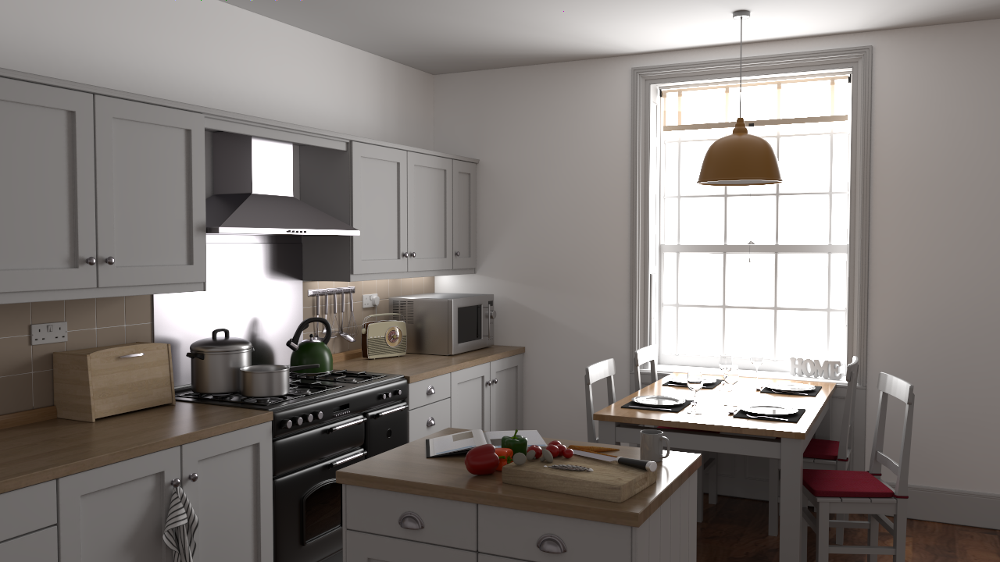

---
layout: FVCM
---

## Abstract

Identifying an appropriate radius for unbiased kernel estimation is crucial for the efficiency of radiance estimation. However, determining both the radius and unbiasedness still faces big challenges. 
In this paper, we first propose a statistical model of photon samples and associated contributions for progressive kernel estimation, under which the kernel estimation is unbiased if the null hypothesis of this statistical model stands.
Then, we present a method to decide whether to reject the null hypothesis about the statistical population (i.e., photon samples) by the F-test in the Analysis of Variance. Hereby, we implement a progressive photon mapping (PPM) algorithm, wherein the kernel radius is determined by this hypothesis test for unbiased radiance estimation.
Secondly, we propose VCM+, a reinforcement of Vertex Connection and Merging (VCM), and derive its theoretically unbiased formulation.
VCM+ combines hypothesis testing-based PPM with bidirectional path tracing (BDPT) via multiple importance sampling (MIS), wherein our kernel radius can leverage the contributions from PPM and BDPT. We test our new algorithms, improved PPM and VCM+, on diverse scenarios with different lighting settings.
The experimental results demonstrate that our method can alleviate light leaks and visual blur artifacts of prior radiance estimate algorithms.
We also evaluate the asymptotic performance of our approach and observe an overall improvement over the baseline in all testing scenarios. 

## Video

<section>
  <button class="btn"  onclick="loadiframe('https://www.youtube.com/embed/sKAel0Sr77k')">Youtube</button>
  <button class="btn"  onclick="loadiframe('//player.bilibili.com/player.html?aid=400780401&bvid=BV1Ho4y1A7dQ&cid=1120081893&page=1')">Bilibili</button>
</section>
<iframe id="videoiframe" width="100%" onload="resizeIframe(this)" src="https://www.youtube.com/embed/sKAel0Sr77k" frameborder="0" allow="accelerometer; autoplay; encrypted-media; gyroscope; picture-in-picture" allowfullscreen></iframe>

